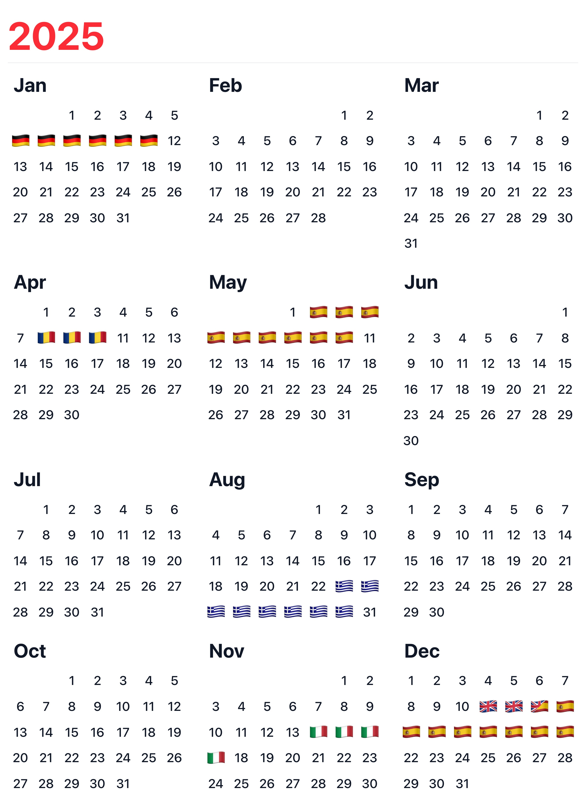

# Yearly

<p align="center">
  
</p>

<p align="center">
  <strong>Your year, at a glance.</strong><br />
  A beautiful travel calendar that turns your trips into shareable art.
</p>

<p align="center">
  
</p>

## What is Yearly?

Yearly helps you create a visual summary of your travel year. Add your countries and travel dates, and get a polished calendar-style snapshot with country flags replacing the dates you were abroad. Perfect for sharing your year-in-review on Instagram, TikTok, or anywhere else.

**Key features:**

- Clean 3×4 calendar grid showing all 12 months
- Country flags automatically appear on your travel dates
- Export as a high-quality image
- Dark mode support

## Tech Stack

- **Framework:** [Next.js 16](https://nextjs.org/) with App Router
- **React:** 19.2
- **Styling:** [Tailwind CSS v4](https://tailwindcss.com/)
- **Animations:** [Motion](https://motion.dev/) (Framer Motion)
- **UI Components:** [Radix UI](https://www.radix-ui.com/) primitives
- **Date handling:** [Day.js](https://day-js.github.io/dayjs/)
- **Image export:** [html-to-image](https://github.com/bubkoo/html-to-image)
- **Testing:** [Vitest](https://vitest.dev/) + Testing Library

## Getting Started

```bash
# Install dependencies
npm install

# Start development server
npm run dev
```

Open [http://localhost:3000](http://localhost:3000) to view the app.

## Scripts

| Command | Description |
|---------|-------------|
| `npm run dev` | Start development server |
| `npm run build` | Create production build |
| `npm run start` | Run production server |
| `npm run lint` | Run ESLint |
| `npm run type-check` | Run TypeScript type checking |
| `npm run test` | Run tests |
| `npm run check` | Run lint + type-check |
| `npm run check:full` | Run lint + type-check + tests + build |

## Project Structure

```
src/
├── app/           # Next.js App Router pages
├── components/    # React components
├── lib/           # Utilities, hooks, and contexts
public/            # Static assets (favicons, images)
```

## License

Private project.
