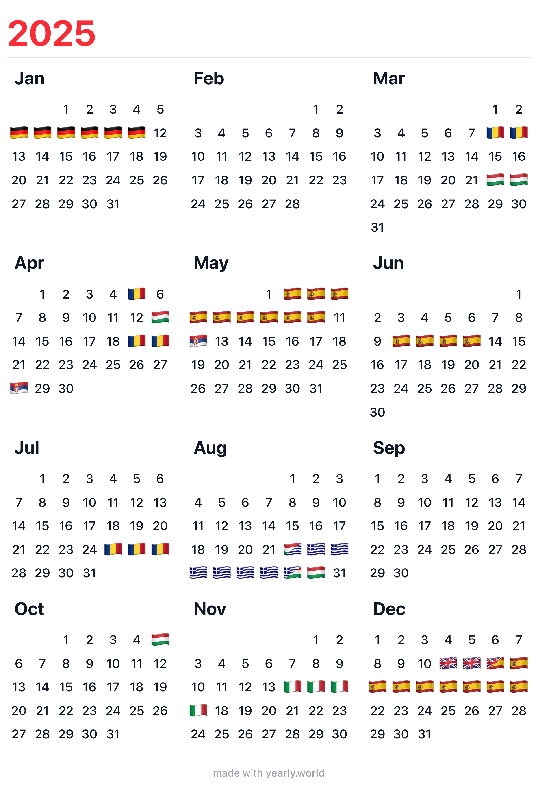

# Yearly

<p align="center">
  
</p>

<p align="center">
  <strong>Your year, at a glance.</strong><br />
  A beautiful travel calendar that turns your trips into shareable art.
</p>

<p align="center">
  <a href="https://www.yearly.world">
    
  </a>
</p>

<p align="center">
  
</p>

## What is Yearly?

Yearly helps you create a visual summary of your travel year. Add your countries and travel dates, and get a polished calendar-style snapshot with country flags replacing the dates you were abroad. Perfect for sharing your year-in-review on Instagram, TikTok, or anywhere else.

**Key features:**

- Clean 3×4 calendar grid showing all 12 months
- Country flags automatically appear on your travel dates (emoji or icon mode)
- Three export types: full-year calendar, monthly story (9:16), and statistics overview
- Dark mode support with Material Design elevation hierarchy
- Travel statistics: countries visited, days abroad, average trip length, and more
- Undo support, data import/export, and local storage persistence
- Mobile-friendly with floating action button and responsive layout
- PWA support

## Tech Stack

- **Framework:** [Next.js 16](https://nextjs.org/) with App Router
- **React:** 19.2
- **Styling:** [Tailwind CSS v4](https://tailwindcss.com/)
- **Animations:** [Motion](https://motion.dev/) (Framer Motion)
- **UI Components:** [Radix UI](https://www.radix-ui.com/) primitives + shadcn/ui
- **Date handling:** [Day.js](https://day-js.github.io/dayjs/)
- **Image export:** [html-to-image](https://github.com/bubkoo/html-to-image)
- **Validation:** [Zod](https://zod.dev/)
- **Database:** [MongoDB](https://www.mongodb.com/) (analytics)
- **Testing:** [Vitest](https://vitest.dev/) + Testing Library

## Getting Started

```bash
# Install dependencies
npm install

# Start development server
npm run dev
```

Open [http://localhost:3000](http://localhost:3000) to view the app.

## Scripts

| Command              | Description                           |
| -------------------- | ------------------------------------- |
| `npm run dev`        | Start development server              |
| `npm run build`      | Create production build               |
| `npm run start`      | Run production server                 |
| `npm run lint`       | Run ESLint                            |
| `npm run format`     | Run Prettier                          |
| `npm run type-check` | Run TypeScript type checking          |
| `npm run test`       | Run tests                             |
| `npm run check`      | Run lint + type-check                 |
| `npm run check:full` | Run lint + type-check + tests + build |

## Project Structure

```
src/
├── app/                # Next.js App Router pages
│   ├── create/         # Main calendar creation page
│   └── admin/          # Admin analytics dashboard
├── components/         # React components
│   └── ui/             # Reusable UI primitives (shadcn/ui)
├── lib/                # Utilities, hooks, and contexts
│   ├── hooks/          # Custom React hooks (exports, status feedback)
│   ├── contexts/       # Settings context (theme, flag mode, week start)
│   └── tracking/       # Event tracking and analytics
public/                 # Static assets (favicons, example images)
```

## License

Private project.
